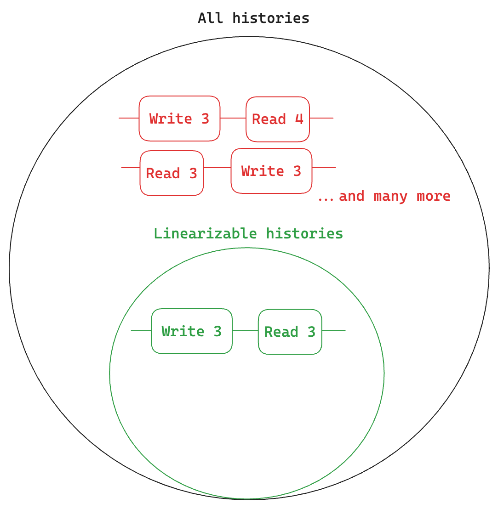

# Interactive Consistency Models

## Demo

> Disclaimer: this project is not yet production ready. Please avoid sharing it broadly, since there are still bugs and pedagogical shortcomings in the website that might confuse more than clarify.

You can watch a video of how to use the website [here](https://www.loom.com/share/35d39938cac5467f8989c9a9f4ffaee7?sid=0b4e24da-e962-4904-a3a3-0c7af8dacf31).

## Pedagogical Motivation

This project aims to bring understanding to consistency models through interactive timeline diagrams. Through personal experience, I have found that consistency models are hard to teach\* for the following reasons:

1. Most individuals new to distributed computing aren't familiar with reasoning about arbitrary interleavings of events (consistency models really are just about specifying what subset of event interleavings are acceptable).
2. Different models have exceptionally subtle differences, which leads learners to questions of the form: "so... how is model X any different from model Y?" and "why does this serialization satisfy model M but not model N"?
3. There are a lot of consistency models, and most of their names don't do a great job of remininding you what they really mean.

I think that the following ideas may help with these issues:

1. Letting people drag around events (within serializations) in their browser invites users into the world of arbitrarily complicated event interleavings, but allows them to explore interleavings at their own pace. An automated consistency-model checker can determine (and explain!) which models are satisfied.
2. We plan on creating a consistency model matrix, where element `[i, j]` satisfies model `i` but not does not satisfy some model `j`. Such a matrix would help answer questions of the form "how does M differ from N?", and I believe this type of matrix would be novel.
3. When consistency models are presented linearly (i.e. "weak" to "strong"), they can be hard to keep track of. But when models are thought of as a tree, it's possible to build up what some model guarantees by considering the guarantees of its children.

Additionally, to help understand what models are the most confusing (and perhaps why), we'll have quizzes as we walk through various consistency models. With user consent, we'll collect (anonymized) results, which we can later use to improve our work. The quizzes will likely be of the form:

-   Using history H, create a serialization that satisfies this model M
-   Using history H, create a serialization that satisfies M but not N

## Making the System Model Visual

### Existing System Model

In recent surveys of formal consistency models [Burkhardt, VV], consistency models are defined using the following system model:

-   There are several sequential clients, each of which is called a "session"
-   Clients issue "operations" to some shared data structure (like reads/writes to a shared variable)
-   Operations can have associated metadata; most notably, a read operation also include _what_ was read
-   The set of operations issued by all clients is called a history
-   A consistency model _constrains_ what histories are allowed

To make that last point a bit visual, here's what we're talking about:



The set of all possible histories is very big, but not all of these histories are what we want clients in a distributed setting to observe. In the previous figure, for example, it doesn't make sense to write 3 and read back 4, or read 3 before we ever write it (which is why they're marked in red). However, the linearizability consistenty model _specifies a subset_ (i.e. constrains) the set of histories it allows, thus giving us the very reasonable write 3 and read back 3 behavior.

### Existing Consistency Models

Histories and constraints on histories don't tell us the entire story, though. They don't explain _why_ a particular history ended up the way that it did. Take the following example, with two clients:

```
1: ---------------------------[R:3]---
2: --[W:3]---------[W:2]--------------
```

In this example, why is it the case that client 1 reads 3 even though 2 was the most recent write? In concrete terms, we can explain why this happened with the following reason:

1. Client 2's first write returned before it ever made it to client 1 (maybe it crashed?)
2. The network reordered the writes, so client 1 received write 3 _after_ write 2

This concrete explanation is helpful, but something more general might help us reason about other situations. Generally, what we've just done is capture and express the _uncertainty_ of distributed systems, where nodes can crash at any time and the network can drop packets, reorder them, delay them, etc. To capture the uncertainties of distributed systems, Burkhardt proposed the following relations:

1. _Visibility_: is an acyclic relation where (a, b) means that the effects of operation a are visible to operation b. In a message-passing system, this would mean that a write **a** issued by some client is visible to the client that issued **b**, before **b** was issued.
2. _Arbitration_: is a total ordering that specifies how write conflicts are resolved (it assumes sytem convergence).

These abstract executions are very helpful for reasoning about certain consistency models. For example, we can express monotonic writes very concisely:

$$
(a, b) \in so \longrightarrow (a, b) \in ar
$$

The issue with abstract executions is that, because they're relations, they're not easily visualizable. We can't just look at a timeline diagram of a history and understand how the uncertainties of the underlying distributed system manifested: to do that, we'd also need to include the abstract executions.

### Formalizing a Serialization

In this tool, we use serializations to explore consistency models. The histories tell us what the clients observed, and the serializations tell us _why_ they observed what they did. In effect, the serializations help us visually express abstract executions in the form of timeline diagrams. This, of course, has been done before: The Art of Multiprocessor Programming (Herlihy, Shavit) use serialiations to teach consistency models, but just a few of the most important ones. Viotti and Vucolic's work have dozens of consistency models, but they don't formally define what a serialization is. Here, we do that.

Now, we sketch a definition for a serialization, and later formalize it. Here's the intuition:

-   A serialization $i$ has all the operations from client $i$, as well as all the writes from the history
-   All properties of the operation remain the same except for the start and end times, which are subject to some constraints below

The constraints are as follow:

1. we say that for serialization $i$, the operations issued by client $i$ are not modified at all, i.e. all their properties remain the same.
2. the writes coming from the other clients might move around, but they must not overlap with each other, since serializations are sequential.

The formal definition of a serialization is now ready to be written out:

(TODO: the work below is a scratchpad)

TODO: _for all operations in the history, in the serialization to which the operation belongs, its start/end time must not be modified_

$$
\forall a \in S_i, \space \nexists b \in S_i  \space | \space (a.stime <= b.etime) \wedge (b.stime <= a.etime)
$$

(Note: that last predicate just tells us [whether two events overlap](https://stackoverflow.com/questions/325933/determine-whether-two-date-ranges-overlap).)

### Abstract Executions

Our end goal is to capture the abstract executions within serializations, so let's do that now.

First, we tackle the _vis_ relation for some operations $a$ and $b$ where $a \xrightarrow{vis} b$:

-   If $a$ and $b$ are both writes, then in all serializations, $a.stime < b.stime$
-   If $a$ is a write and $b$, then in serialization ${b.proc}$, $a.stime < b.stime$.
-   If $a$ is a read, then it's not visible to anything in the future, so we don't need to anything in these cases.

Next, we tackle the _ar_ relation for some operations $a$ and $b$ where $a \xrightarrow{ar} b$. Since _ar_ specifies a total ordering on writes as defined by the conflict resolution strategy, we can simply say that for all serializations, $a.stime < b.stime$.

(TODO: this might not be entirely correct... it's possible that $a \xrightarrow{ar} b$ does not imply this order in every single serialization, since the conflict-resolution logic would do correct resolution, even if the writes aren't in the arbitration order.)

## Current Work

-   Provide a guided tour through all the consistency models, so that we explain the idea of histories and serializations
-   Create a "model M but not model N" matrix of consistency models for quick reference
-   Add the ability for the consistency-model checker to explain why something satisfies/fails to satisfy a particular model
-   Hook up our unit tests to GitHub actions
